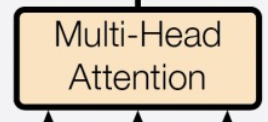
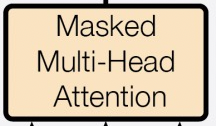
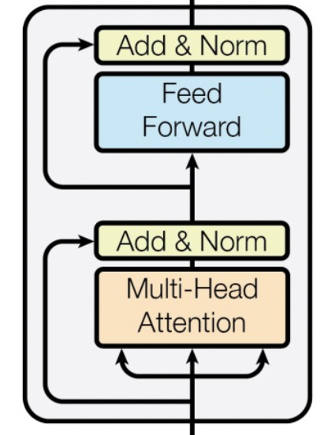
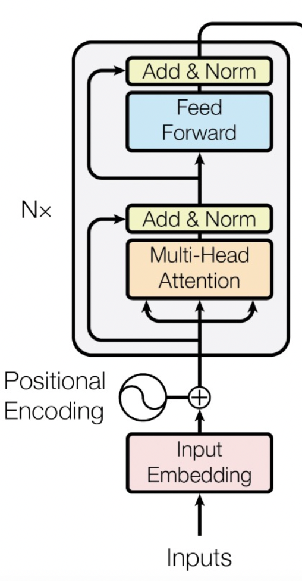

# Transformer_pytorch

## Project Overview 📊
Use pytorch to build Transformer model structure

  

## Step1: Build the Attention layer 🛠️

  

### Multi-head attention: 
The input at each position can simultaneously focus on all other positions in the sequence. This means that each position can receive information from all other positions in the input sequence.

### Masked Multi-head attention: 
In the Decoder, since the order from left to right needs to be followed when generating the output sequence, at each time step, the model can only focus on the position before the current position, rather than the entire input sequence. This means that during the process of generating the sequence, the model cannot see the information behind the current position to avoid information leakage.
In order to achieve this, the Masked Attention in the Decoder will mask out the information after the current position when calculating the Attention weight, usually using a mask matrix.

## Step2: Build the Transformer Block 🛠️

  

 

### Layer Normalization 
Layer Normalization: Calculate the mean and variance of the output of each layer and use it to normalize the output of the layer. It does not rely on the batch size or batch statistics, but only focuses on the output of each layer.

## Step3: Build the Encoder 🛠️

  

## Step4: Build the Decoder Block and Decoder 🛠️

## Step5: Combine the above structures together to form the Transformer model 🛠️

