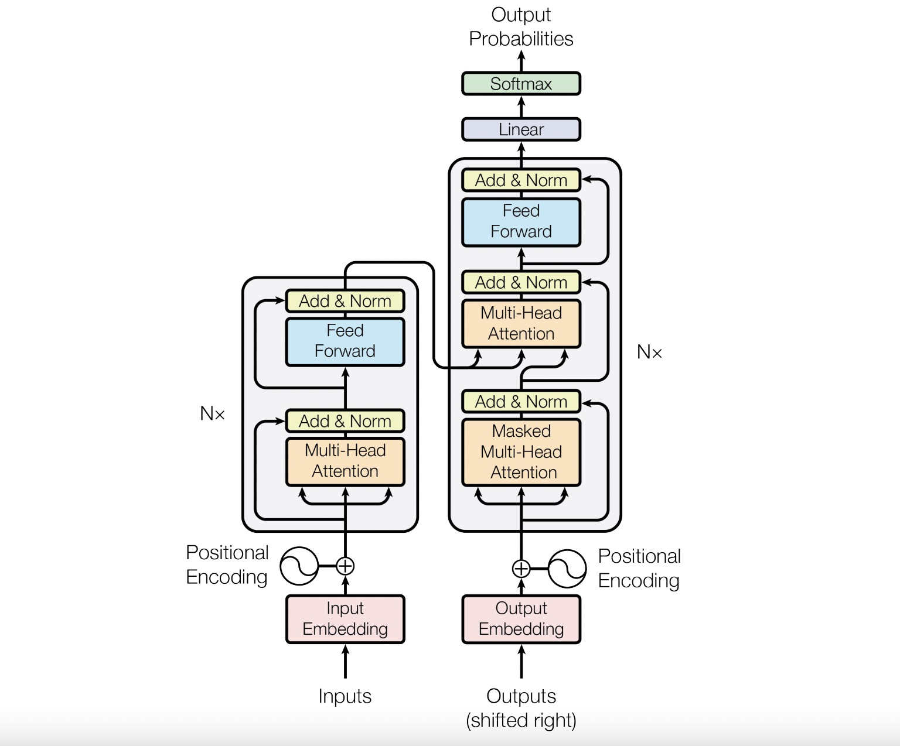

# Transformer_pytorch

## Project Overview 📊
Use pytorch to build Transformer model structure

  

## Step1: Build the Attention layer 🛠️

  

## Step2: Build the Transformer Block 🛠️

  

## Step3: Build the Encoder 🛠️

  

## Step4: Build the Decoder Block and Decoder 🛠️

## Step5: Combine the above structures together to form the Transformer model 🛠️

